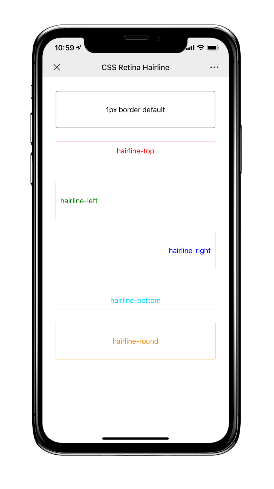

# hairline.css

CSS retina hairline, implement by CSS pseudo-element and CSS Variables.

Most webpack-based projects can work well. [Examples](https://wangchi.github.io/hairline.css)

## Preview

<p>

</p>

## Usage

```shell
npm i hairline.css --save
```

Import `hairline.css` in your project like this:

```jsx
import React from 'react';
import 'hairline.css';
import './App.css';

function App() {
  return (
    <>
      <div className="box border-default">1px border default</div>

      <div className="box hairline-top">hairline-top</div>

      <div className="box hairline-left">hairline-left</div>

      <div className="box hairline-right">hairline-right</div>

      <div className="box hairline-bottom">hairline-bottom</div>

      <div className="box hairline-round">hairline-round</div>
    </>
  );
}

export default App;
```

Then, you can use `hairline-top`, `hairline-left`, `hairline-right`, `hairline-bottom` or `hairline-round` as class name as required.

## Custom border color

Default border color is `#666`， you can use CSS Variable `--hairline-color` custom the border color:

```css
.hairline-top {
  /* custom border color is red */
  --hairline-color: red;
  padding-top: 10px;
  width: 200px;
}
```

## License

[MIT LICENSE](./LICENSE)
